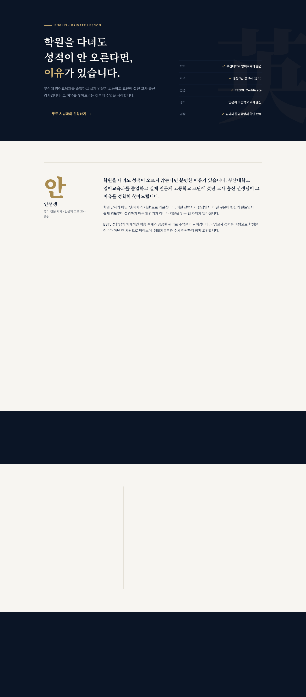

<div align="center">

# 안선생 영어과외

**"학원을 다녀도 성적이 안 오른다면, 이유가 있습니다."**

교사 출신 영어 과외 선생님의 소개 랜딩 페이지 &middot; 학년별 분기형 학생 프로필 입력 폼

[**🔗 Live Demo**](https://maybeags.github.io/tutor-profile/) &nbsp;·&nbsp;
[Report Bug](https://github.com/maybeags/tutor-profile/issues) &nbsp;·&nbsp;
[Request Feature](https://github.com/maybeags/tutor-profile/issues)


</div>

<br />

<div align="center">
  
</div>

<br />

## About

과외 선생님이 신규 학생을 받을 때 쓰는 2단 구성의 웹 서비스입니다.

1. **소개 페이지** — 강사의 이력과 강점을 에디토리얼 톤으로 소개하는 랜딩 페이지
2. **프로필 입력 페이지** — 중학생 / 고등학생 분기에 따라 서로 다른 질문으로 학생 정보를 수집하는 폼

디자인은 "프리미엄 입시학원 브랜드"를 컨셉으로, 딥 네이비 + 브라스 골드 팔레트와 세리프 타이포그래피, 스크롤 리빌·카운트업 모션을 적용해 전형적인 AI 생성 템플릿 느낌을 피하는 데 초점을 맞췄습니다.

<br />

## Features

| | |
|---|---|
| 🎯 **에디토리얼 랜딩** | 좌측 정렬 히어로, 헤어라인 기반 섹션 구분, 골드 워터마크 등 절제된 브랜드 아이덴티티 |
| ✨ **스크롤 모션** | `IntersectionObserver` 기반 리빌 애니메이션과 통계 카운트업 (`prefers-reduced-motion` 대응) |
| 🧭 **분기형 온보딩** | 중학생 / 고등학생 선택에 따라 완전히 다른 입력 필드 세트로 안내 |
| 📋 **제출 없는 제출** | 백엔드·DB 없이 입력 내용을 요약 텍스트로 만들어 클립보드 복사 (카카오톡 등으로 직접 전달) |
| 📱 **반응형** | 375px 모바일부터 데스크톱까지 레이아웃 붕괴 없이 대응 |
| 🚀 **자동 배포** | `main` 브랜치 push 시 GitHub Actions가 빌드해 GitHub Pages에 자동 배포 |

<br />

## Preview

<table>
  <tr>
    <td width="70%"></td>
    <td width="30%"></td>
  </tr>
  <tr>
    <td align="center"><sub>Desktop — Full Page</sub></td>
    <td align="center"><sub>Mobile — 390px</sub></td>
  </tr>
</table>

<br />

## Tech Stack

- **Framework**: React 19 + Vite
- **Routing**: React Router (`HashRouter`, GitHub Pages 정적 호스팅 호환)
- **Styling**: Plain CSS, 디자인 토큰 기반 (`src/styles/index.css`) — 별도 UI 라이브러리 없이 직접 설계
- **Fonts**: Noto Serif KR(디스플레이) + Pretendard(본문)
- **Deploy**: GitHub Actions → GitHub Pages

<br />

## Project Structure

```
src/
├── components/       # StepIndicator, Reveal, CountUp, 폼 필드 컴포넌트
├── data/             # tutorProfile.js — 소개 페이지 콘텐츠 (마케팅 카피, 경력 등)
├── pages/
│   ├── IntroPage.jsx           # 소개 랜딩 페이지
│   ├── ProfileSelectPage.jsx   # 중/고등학생 분기 선택
│   ├── MiddleSchoolFormPage.jsx
│   ├── HighSchoolFormPage.jsx
│   └── SummaryPage.jsx         # 입력 요약 + 클립보드 복사
└── styles/
    └── index.css      # 디자인 토큰 + 전체 스타일
```

<br />

## Getting Started

```bash
npm install
npm run dev       # http://localhost:5173
```

```bash
npm run build      # dist/ 로 프로덕션 빌드
npm run preview    # 빌드 결과 로컬 미리보기
```

<br />

## Deployment

`main` 브랜치에 push되면 [`.github/workflows/deploy.yml`](.github/workflows/deploy.yml) 워크플로우가 자동으로 빌드 후 GitHub Pages에 배포합니다. 별도의 서버나 데이터베이스 없이 정적 파일만으로 동작하는 구조라 배포 파이프라인이 단순합니다.

> **참고**: 학생 프로필 입력 데이터는 서버에 저장되지 않습니다. 제출 시 브라우저 메모리에서 요약 텍스트를 생성해 화면에 보여주고, 사용자가 직접 복사해 선생님께 전달하는 방식입니다.

<br />

## License

MIT
