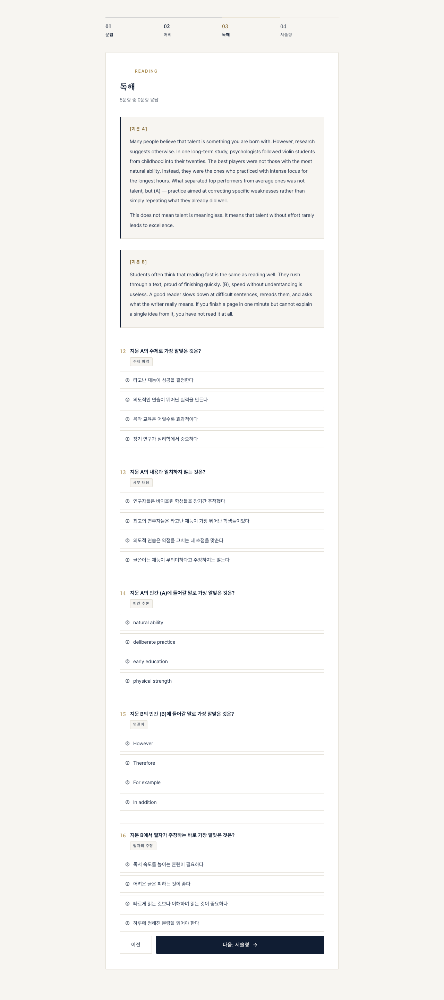
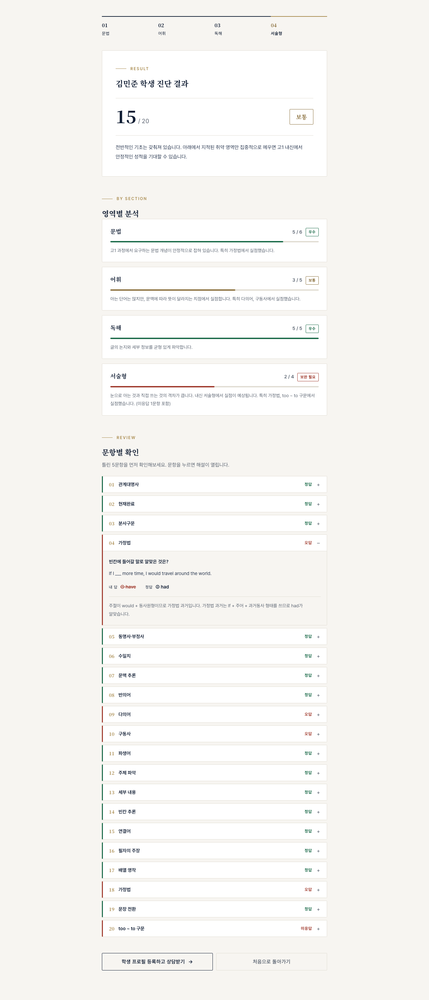
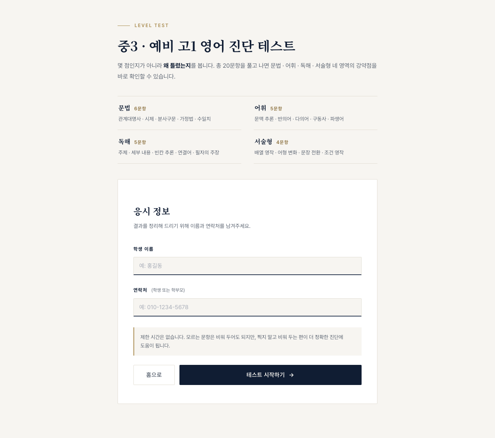

<div align="center">

# 안선생 영어과외

### <em>"학원을 다녀도 성적이 안 오른다면, 이유가 있습니다."</em>

교사 출신 영어 과외 선생님의 브랜드 랜딩 페이지 &middot; 학년별 분기형 학생 프로필 폼 &middot; 20문항 자동 채점 레벨테스트

<br />

[**🔗 Live Demo**](https://maybeags.github.io/tutor-profile/) &nbsp;&middot;&nbsp;
[레벨테스트 바로 응시](https://maybeags.github.io/tutor-profile/#/test) &nbsp;&middot;&nbsp;
[Issues](https://github.com/maybeags/tutor-profile/issues)

<br />


<br />


</div>

<br />

## 프로젝트 소개

과외 선생님이 신규 학생을 받는 과정 전체를 하나의 정적 사이트로 만든 프로젝트입니다. **서버도 데이터베이스도 없이** 세 가지 흐름이 돌아갑니다.

```
소개 랜딩  ─┬─▶  학생 프로필 입력  ──▶  요약 · 클립보드 복사  ──┐
            │      (중등 / 고등 분기)                              ├──▶  구글 시트
            └─▶  레벨테스트 20문항  ──▶  자동 채점 · 영역별 피드백 ─┘
```

디자인은 **"프리미엄 입시학원 브랜드"** 컨셉으로, 딥 네이비 + 브라스 골드 팔레트와 명조 세리프 타이포그래피를 씁니다. 그라데이션 히어로·이모지 섹션 마커·전면 센터 정렬 같은 흔한 템플릿 문법을 의도적으로 피하고, 헤어라인과 여백으로 구획하는 에디토리얼 레이아웃을 택했습니다.

<br />

## 주요 기능

<table>
<tr>
<td width="33%" valign="top">

### 📐 에디토리얼 랜딩

좌측 정렬 비대칭 히어로, 헤어라인 기반 섹션 구분, 골드 워터마크. 경력은 실제 시간 순서가 있는 데이터라 타임라인으로 표현했습니다.

</td>
<td width="33%" valign="top">

### 🧭 분기형 온보딩

중학생 / 고등학생 선택에 따라 완전히 다른 질문 세트로 안내합니다. 고등은 계열 · 내신 등급 · 모의고사 등급 · 준비 전형까지 수집합니다.

</td>
<td width="33%" valign="top">

### 📝 자동 채점 레벨테스트

중3 · 예비고1 대상 20문항. **객관식은 물론 서술형까지** 클라이언트에서 자동 채점하고 영역별 강약점을 진단합니다.

</td>
</tr>
<tr>
<td valign="top">

### ✨ 스크롤 모션

`IntersectionObserver` 리빌 애니메이션과 통계 카운트업. `prefers-reduced-motion`을 존중해 모두 비활성화됩니다.

</td>
<td valign="top">

### 📊 구글 시트 로깅

자체 백엔드 없이 Apps Script Web App으로 프로필과 테스트 결과를 각각 다른 시트 탭에 자동 기록합니다.

</td>
<td valign="top">

### 🚀 자동 배포

`main` push → GitHub Actions 빌드 → GitHub Pages. `HashRouter`를 써서 정적 호스팅에서도 딥링크가 깨지지 않습니다.

</td>
</tr>
</table>

<br />

## 레벨테스트

`/test`에서 이름만 남기면 바로 응시할 수 있고, **문법 → 어휘 → 독해 → 서술형** 네 단계로 진행됩니다.

| 영역 | 문항 | 점검 항목 |
|:---|:---:|:---|
| **문법** | 6 | 관계대명사 · 현재완료 · 분사구문 · 가정법 · 동명사/부정사 · 수일치 |
| **어휘** | 5 | 문맥 추론 · 반의어 · 다의어 · 구동사 · 파생어 |
| **독해** | 5 | 주제 · 세부 내용 · 빈칸 추론 · 연결어 · 필자의 주장 <sub>(지문 2편)</sub> |
| **서술형** | 4 | 배열 영작 · 어형 변화 · 문장 전환 · 조건 영작 |

출제 기준은 **중3에서 고1 내신·모의고사로 넘어갈 때 실제로 무너지는 지점**입니다. 단순 암기 확인이 아니라, 틀렸을 때 *무엇을 안 배웠는지*가 드러나도록 문항마다 `topic` 태그를 답니다.

<div align="center">

<br /><sub>독해 단계 — 지문 2편과 5문항</sub>
</div>

<br />

### 서술형을 자동 채점하는 법

백엔드가 없으니 서술형도 브라우저에서 채점해야 합니다. 그래서 **정답이 하나로만 결정되도록** 조건을 설계했습니다.

- 주어진 단어를 **모두 한 번씩** 사용하는 배열 영작
- 단어 수 지정 — *"총 9단어로 쓸 것"*
- 필수 표현 지정 — *"`too`를 반드시 사용할 것"*

채점 시 대소문자 · 문장부호 · 앞뒤/연속 공백을 정규화하므로, 아래 입력은 모두 정답 처리됩니다.

```
"  He is the KINDEST person I have ever met.  "   ✅
"he is the kindest person i have ever met"        ✅
```

<br />

### 점수가 아니라 진단을 줍니다

정답률로 등급(우수 / 보통 / 보완 필요)을 매기는 데서 그치지 않고, **틀린 문항의 `topic`을 모아** 문장을 만듭니다.

> **어휘 3/5 — 보통**
> 아는 단어는 많지만, 문맥에 따라 뜻이 달라지는 지점에서 실점합니다. 특히 **다의어, 구동사**에서 실점했습니다.

> **서술형 2/4 — 보완 필요**
> 눈으로 아는 것과 직접 쓰는 것의 격차가 큽니다. 내신 서술형에서 실점이 예상됩니다. 특히 **가정법, too ~ to 구문**에서 실점했습니다. (미응답 1문항 포함)

미응답은 오답과 구분해 표시하고, 문항별 해설은 아코디언으로 펼쳐볼 수 있습니다.

<div align="center">

<br /><sub>결과 페이지 — 영역별 분석, 오답 해설 아코디언</sub>
</div>

<br />

## 화면

<table>
<tr>
<td width="34%" valign="top"></td>
<td width="46%" valign="top"></td>
<td width="20%" valign="top"></td>
</tr>
<tr>
<td align="center"><sub>레벨테스트 안내</sub></td>
<td align="center"><sub>랜딩 — 전체</sub></td>
<td align="center"><sub>모바일 390px</sub></td>
</tr>
</table>

<br />

## 기술 스택

| | |
|:---|:---|
| **Framework** | React 19 + Vite |
| **Routing** | React Router 7 (`HashRouter` — 정적 호스팅에서 딥링크 유지) |
| **Styling** | Plain CSS + 디자인 토큰. UI 라이브러리 없이 직접 설계 |
| **Fonts** | Noto Serif KR <sub>(디스플레이)</sub> + Pretendard <sub>(본문)</sub> |
| **State** | `useState` + 라우터 `location.state`. 전역 상태 라이브러리 없음 |
| **Backend** | 없음. 선택적으로 Google Apps Script Web App을 웹훅으로 사용 |
| **CI/CD** | GitHub Actions → GitHub Pages |

<br />

## 구조

```
src/
├── components/
│   ├── StepIndicator.jsx      # 단계 표시 (steps props로 3·4단계 겸용)
│   ├── Reveal.jsx             # IntersectionObserver 스크롤 리빌
│   ├── CountUp.jsx            # 통계 숫자 카운트업
│   ├── PassageBox.jsx         # 독해 지문 박스
│   └── …                      # SharedFields, RadioPillGroup, CheckboxGroup
├── data/
│   ├── tutorProfile.js        # 랜딩 콘텐츠 (카피 · 경력 · 통계)
│   └── levelTest.js           # 20문항 · 지문 · 정답 · topic · 해설
├── lib/
│   ├── gradeTest.js           # 채점 · 영역별 집계 · 피드백 생성
│   ├── summary.js             # 프로필 요약 텍스트 조립
│   └── submitToSheet.js       # 구글 시트 웹훅 (profile / levelTest 분기)
├── pages/
│   ├── IntroPage.jsx                    # 소개 랜딩
│   ├── ProfileSelectPage.jsx            # 중 / 고 분기
│   ├── MiddleSchoolFormPage.jsx
│   ├── HighSchoolFormPage.jsx
│   ├── SummaryPage.jsx                  # 요약 + 클립보드 복사
│   ├── TestIntroPage.jsx                # 레벨테스트 안내
│   ├── TestQuizPage.jsx                 # 영역별 4단계 응시
│   └── TestResultPage.jsx               # 채점 결과 · 피드백
└── styles/index.css           # 디자인 토큰 + 전체 스타일
```

> 문항을 바꾸고 싶다면 [`src/data/levelTest.js`](src/data/levelTest.js) **하나만** 고치면 됩니다. 채점과 피드백이 `section` / `topic` 필드를 따라 자동으로 반영됩니다.

<br />

## 시작하기

```bash
npm install
npm run dev          # http://localhost:5173
```

```bash
npm run build        # dist/ 로 프로덕션 빌드
npm run preview      # 빌드 결과 로컬 확인
```

구글 시트 연동은 선택입니다. 쓰려면 `.env`에 웹훅 URL을 넣으세요 — 없으면 시트 기록만 건너뛰고 나머지는 그대로 동작합니다.

```bash
cp .env.example .env
# VITE_SHEET_WEBHOOK_URL=https://script.google.com/macros/s/.../exec
```

설정 방법은 [구글 시트 연동 가이드](docs/google-sheet-setup.md)에 단계별로 정리해 두었습니다.

<br />

## 배포

`main` 브랜치에 push하면 [`deploy.yml`](.github/workflows/deploy.yml)이 빌드 후 GitHub Pages에 배포합니다. 웹훅 URL은 저장소 시크릿 `SHEET_WEBHOOK_URL`에서 빌드 시 주입됩니다.

> [!NOTE]
> **데이터는 기본적으로 어디에도 저장되지 않습니다.** 프로필과 테스트 응답은 브라우저 메모리에서만 처리되어 화면에 표시되고, 새로고침하면 사라집니다. `VITE_SHEET_WEBHOOK_URL`을 설정한 경우에만 구글 시트에 추가로 기록됩니다.

> [!WARNING]
> 웹훅 URL은 정적 사이트 특성상 빌드된 JS 번들에 포함되어 **공개적으로 노출됩니다.** URL을 아는 사람은 폼을 거치지 않고도 시트에 데이터를 넣을 수 있습니다. 공개 배포 시에는 Apps Script 쪽에 토큰 검증을 추가하는 것을 권장합니다.

<br />

## License

MIT
